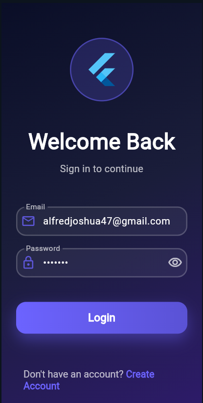
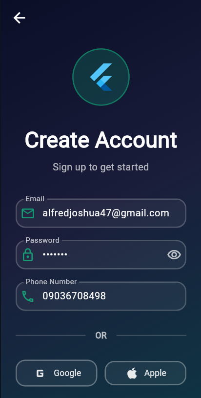

# Flutter Auth Assignment

A simple Flutter authentication UI showcasing:
- Login screen
- Create account screen
- Success confirmation screen

## Screenshots

### Login Screen

### Create Account Screen

> Place your actual screenshot images inside the `screenshots/` folder
> using the exact filenames above.
